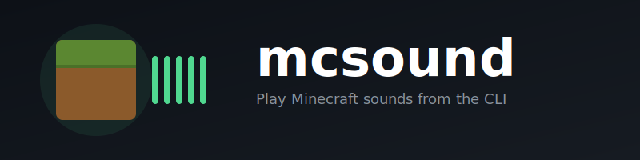

<p align="center">
  
</p>

<p align="center">
  <strong>Add Minecraft sound effects to Claude Code</strong>
</p>

<p align="center">
  <code>claude plugin install github:andrewgazelka/mcsound</code>
</p>

---

A Claude Code plugin that plays Minecraft sounds for coding events — hear a door open when you start a session, level up when tasks complete, and amethyst chimes when files are saved.

## Sound Mappings

| Event | Sound |
|-------|-------|
| Session start | `random/door_open` |
| Session end | `random/door_close` |
| Task complete | `random/levelup` |
| Subagent complete | `random/orb` |
| Notification | `note/bell` |
| File write/edit | `block/amethyst/place1` |
| Bash command | `random/click` |
| Task spawn | `block/end_portal/endportal` |
| Web search/fetch | `block/end_portal/eyeplace1` |

## Requirements

- Minecraft Java Edition must have been launched at least once (to download sound assets)
- [Nix](https://nixos.org/) (the plugin uses `nix run` for zero-install execution)

---

<details>
<summary>Standalone CLI usage</summary>

Can also be used as a standalone CLI tool:

```bash
# Run directly with Nix
nix run github:andrewgazelka/mcsound -- play mob/zombie/death

# List all sounds
nix run github:andrewgazelka/mcsound -- list

# Filter sounds
nix run github:andrewgazelka/mcsound -- list zombie
```

**Install with Cargo:**
```bash
cargo install --git https://github.com/andrewgazelka/mcsound

mcsound play mob/zombie/death
mcsound list zombie
```

**Minecraft path:** Auto-detects standard locations. Override with `MINECRAFT_HOME` env var.

</details>

<details>
<summary>How it works</summary>

Reads the Minecraft asset index to map sound names to hashed files in `.minecraft/assets/objects/`. Audio playback is bundled (no ffmpeg required).

</details>
